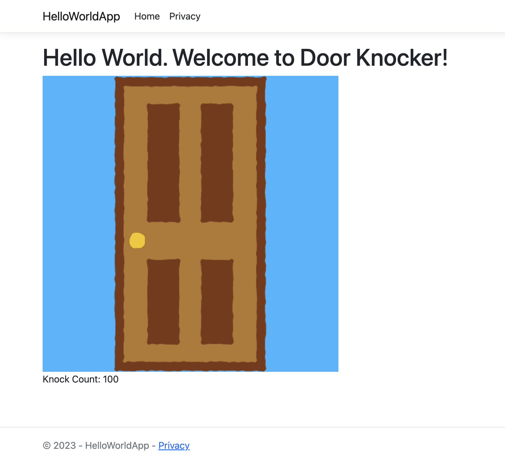

# HelloWorldApp - DoorKnocker
This is an ASP.NET application deployed with Azure where the user knocks on a door and the knock count is displayed. By "knocking" on the door (clicking the door image), the knock count will increment by one.

## Running the Application Locally

You’ll need the .NET Software Development Kit (SDK). Download the installer for your operating system and follow the installation instructions on the [.NET Core Downloads page](https://dotnet.microsoft.com/download/dotnet/).  

To run the HelloWorldApp locally, follow these steps:

1. **Navigate to the project directory where the `.csproj` file is located.**

2. **Type and enter `dotnet run` in the project's terminal.**  

After running `dotnet run` the web browser automatically opens `https://localhost:5001`. Click on the door image to "knock" and see the knock count increment with each click.

# Screenshot
  
